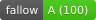

 

<picture>
	<source media="(prefers-color-scheme: dark)" srcset="./.github/assets/logo-dark.svg">
	
</picture>

<small>Opinionated Node CLI Toolkit</small>

   

---

## API

---

<small>© 2026 [Mike Simmonds](https://mike.id)</small>
